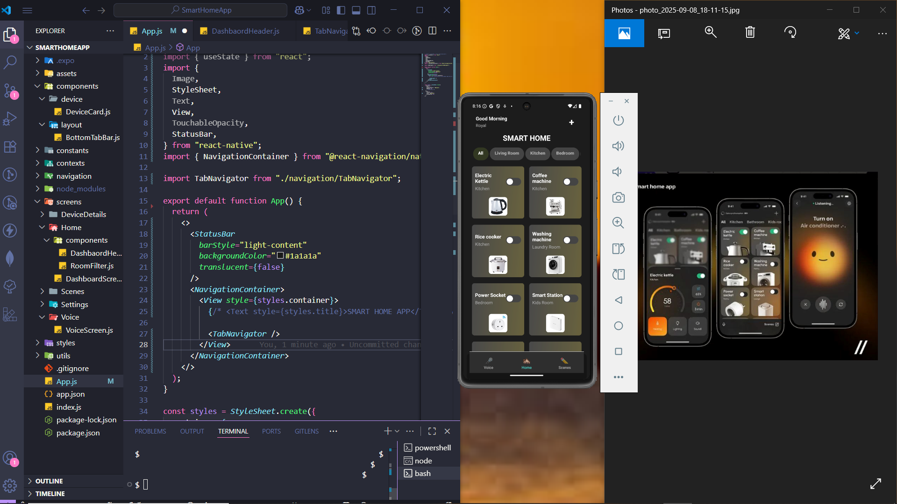

# Smart Home Control App

A modern, cross-platform mobile application built with React Native for managing and controlling smart home devices. This app provides a home dashboard, voice control capabilities, and a seamless user experience for interacting with a connected home ecosystem or devices

> **Current Phase:** 🧪 **Prototype & Simulation** (The app is currently in development progress and it will interacts with a mock backend to simulate device behavior, which will then be ready for integration with real hardware devices)

## Screenshots & Demo




## Features

### Implemented
- **Centralized Dashboard:** View and control all your smart devices from a single, clean interface.
- **Device Control:** Toggle devices on/off and view their real-time status.
- **Voice Command Interface:** UI for initiating voice controls (basic simulation implemented).
- **Mock Backend:** Still to be build and simulated to mimics the latency and behavior of real IoT devices.
- **Responsive UI:** A modern, user-friendly interface inspired by modern design principles.

### 📅 Planned work & In Progress
- **Hardware Integration:** API readiness for connecting to real devices (ESP32, Raspberry Pi, etc.).
- **Advanced Device Controls:** Support for more properties (e.g., brightness, temperature, modes).
- **User Authentication & Multi-Home Support.**
- **Automations & Scenes:** Create routines to control multiple devices with one trigger.
- **Real-time Updates:** Implement WebSockets (Socket.IO) for instant state synchronization.

## Tech Stack

- **Frontend:** React Native, Expo
- **State Management:** React Context API / Zustand
- **HTTP Client:** Axios
- **Navigation:** React Navigation
- **Voice Control:** `react-native-voice`
- **Backend (Simulator):** Node.js, Express.js
- **Real-Time Communication:** Socket.IO (Planned to be implemented)

## Project Structure
src/
├── components/ # Reusable UI components
├── screens/ # App main screens
├── navigation/ # Navigation setup
├── services/ # API and external services
├── constants/ # Colors, device types, etc.
├── contexts/ # React Contexts for state
├── hooks/ # Custom React Hooks
└── assets/ # Images, icons, fonts


## ⚙️ Installation & Setup

### Prerequisites
- Node.js (v18 or newer)
- npm or yarn
- Expo CLI (`npm install -g expo-cli`)
- A mobile device with the Expo Go app or an iOS/Android simulator.

### Steps
1.  **Clone the repository:**
    ```bash
    git clone https://github.com/TIZIHMARKP/Smart-Home-App.git
    cd SmartHomeApp
    ```

2.  **Install dependencies:**
    ```bash
    npm install
    ```
3.  **Start the Expo App (Terminal Tab 2):**
    ```bash
    npm start
    ```
4.  **TODO || (BACKEND SIMULATION) Start the Mock Backend Server (Terminal Tab 1):**
    ```bash
    cd server
    npm install
    npm run dev
    ```
    *Server runs on http://localhost:3001*

    Use the Expo Go app on your phone to scan the QR code, or press `a` for Android simulator / `i` for iOS simulator.

## Usage

1. Open the app on your device.
2. The dashboard will automatically load with your simulated smart devices.
3. Tap any device card to toggle its state on or off.
4. Navigate to the Voice Control tab to test the voice command interface.

## 🔌 API Integration (For Developers)

The app is being built to be easily connected to real hardware. The simulation service which will be build will provide a RESTful API that mirrors the endpoints a real hardware backend would have.

**Key Endpoints:**
- `GET /api/devices` - Fetches all devices
- `PATCH /api/devices/:id` - Updates a specific device's state

TODO || To integrate real devices

## 🤝 Contributing

Contributions, issues, and feature requests are welcome! Feel free to check the issues page.

1. Fork the Project
2. Create your Feature Branch (`git checkout -b feature/AmazingFeature`)
3. Commit your Changes (`git commit -m 'Add some AmazingFeature'`)
4. Push to the Branch (`git push origin feature/AmazingFeature`)
5. Open a Pull Request

## 📝 License

This project is currently for demonstration and portfolio purposes. All rights reserved.

## 📮 Contact

TIZIH MARK - [@https://x.com/MARKMARKO1234](https://x.com/MARKMARKO1234) - princetmk10@gmail.com

Project Link: [https://github.com/TIZIHMARKP/Smart-Home-App.git](https://github.com/TIZIHMARKP/Smart-Home-App.git)

---

**Disclaimer:** This is a portfolio project.